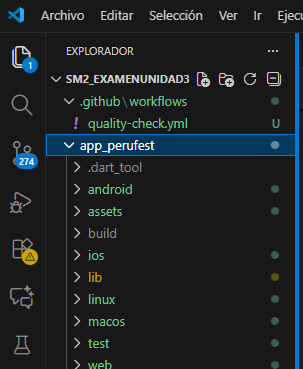
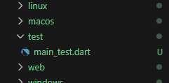
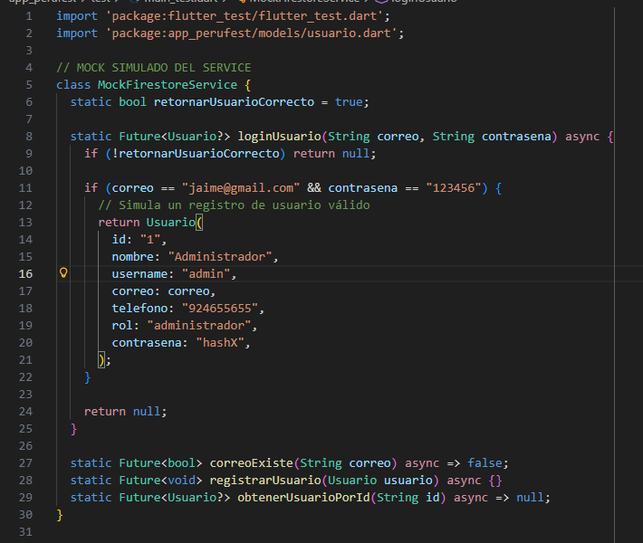
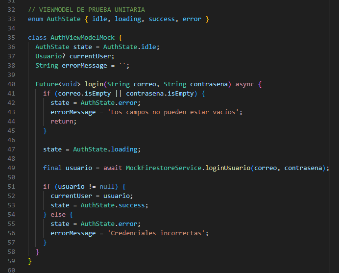
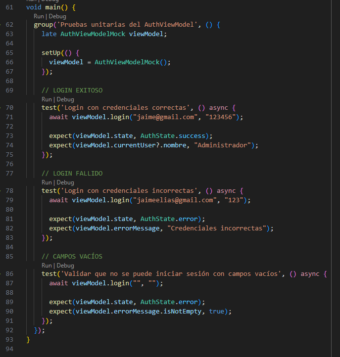
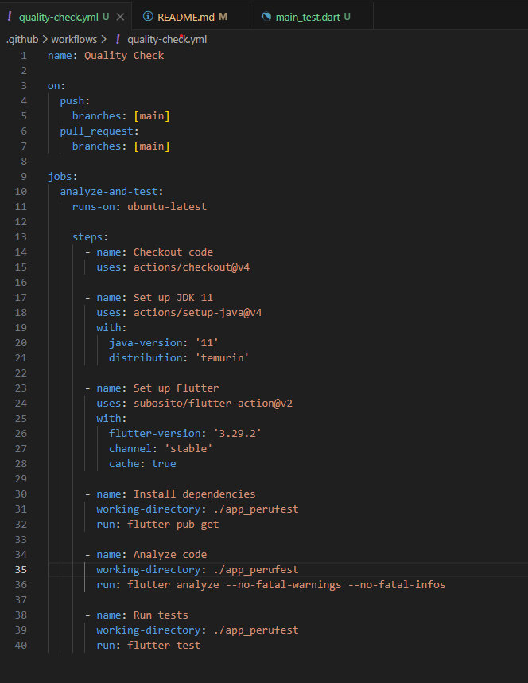
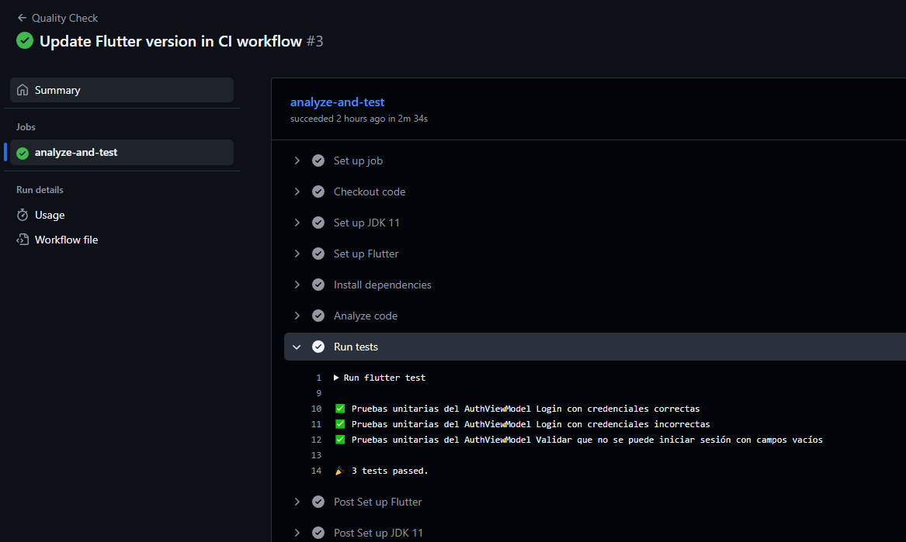

# EXAMEN PRÁCTICO – UNIDAD III

**Curso**: Desarrollo de Aplicaciones Móviles

**Fecha**: 18 de noviembre de 2025

**Estudiante**: Jaime Elias Flores Quispe

**Repositorio**: `https://github.com/jf2021070309/SM2_ExamenUnidad3`

**Entrega**: README.md convertido a PDF con evidencia y documentación

**Objetivo**: Implementar un flujo de trabajo (workflow) automatizado en GitHub Actions para realizar análisis de calidad sobre el proyecto móvil e integrar prácticas de DevOps.

**Actividades realizadas**

- **Crear repositorio**: Se creó el repositorio público con nombre exacto `SM2_ExamenUnidad3`.
- **Copiar proyecto**: Se copió todo el contenido del proyecto móvil al repositorio.
- **Crear carpetas**: Se añadieron las carpetas obligatorias: `/.github/workflows/` y `/test/`.
- **Crear archivos**: Se creó `quality-check.yml` en `/.github/workflows/` y `main_test.dart` en `/test/` con al menos 3 pruebas unitarias.

**Estructura relevante (evidencia)**

Captura de la estructura de carpetas mostrando ` .github/workflows/ `:

---

**Captura de `test/main_test.dart`**

Captura que muestre el archivo `test/main_test.dart` con las pruebas unitarias:

**Contenido de `main_test.dart`**

Mock de una servicio simulado:

ViewModel de una clase para login:

Funcion de las 3 pruebas unitarias:

**Contenido de `quality-check.yml`**

Captura de pantalla del contenido del archivo `quality-check.yml`:

**Ejecución del workflow (evidencia)**

Captura de la pestaña `Actions` mostrando la ejecución del workflow y el resultado `100% passed`:

**Explicación de lo realizado**

- **¿Qué hace el workflow?**: Al hacer `git push` a `main` o crear un `pull_request` hacia `main`, GitHub Actions ejecuta los pasos: instalar Flutter, obtener dependencias, ejecutar `flutter analyze` y ejecutar `flutter test`. Esto permite detectar errores estáticos y regressiones en pruebas.
- **`flutter analyze`**: Verifica estilo, convenciones y errores estáticos.
- **`flutter test`**: Ejecuta las pruebas unitarias definidas en `test/`.
